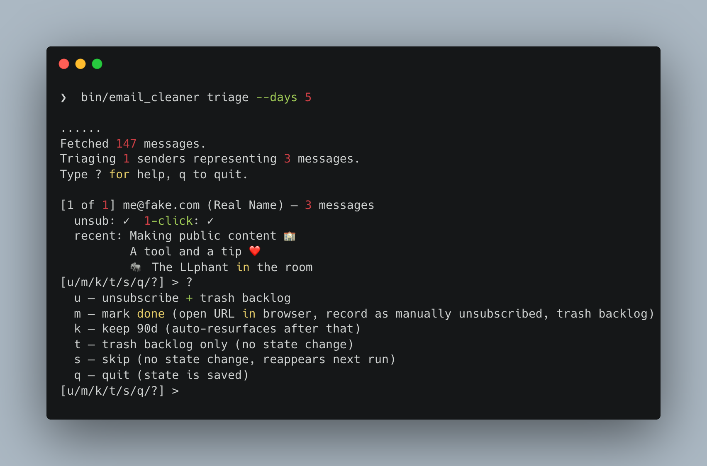

# Email Cleaner

I've had my gmail for 15+ years and have accumulated way too many email subscriptions that I didn't care for.
Manually going through and clearing it out sucked, so I built a tool to "triage" your emails, and see what you may no longer care about.

Hopefully you'll find it as useful as I did!



## What it does

The main flow is `triage`: it pulls the senders sending you the most
mail in the last 30 days, walks them top-to-bottom, and for each one
prompts:

```
[1 of 47] hello@deals.going.com (Going) — 47 messages
  unsub: ✓  1-click: ✓
  recent: Tax Day flight deals to Mexico City
          Last call: $310 RT to Tokyo
          New: $200 to Cartagena
[u/m/k/t/s/q/?] >
```

You hit one key:

| | |
|---|---|
| **u** | Unsubscribe (one-click POST or mailto) and trash the backlog. |
| **m** | Open the sender's preferences page in your browser, mark as done, and trash the backlog. Use this when the unsubscribe needs a login. |
| **k** | Keep for 90 days. Won't surface again until then. |
| **t** | Trash the backlog only; leave subscription state alone. |
| **s** | Skip; reappears next run. |
| **q** | Quit. State is saved per-decision, so you can resume any time. |

When you quit (or finish the list), you get a recap grouped by action
with addresses and total messages trashed.

## Setup

You need a personal Google Cloud project with a Desktop OAuth client.
This is a one-time, ~5-minute setup.

1. **Create a Google Cloud project** at
   https://console.cloud.google.com/.

2. **Enable the Gmail API.** APIs & Services → Library → search
   "Gmail API" → Enable.

3. **Create an OAuth client (Desktop app).** APIs & Services →
   Credentials → Create Credentials → OAuth client ID → Application
   type **Desktop app**. Desktop clients allow loopback redirects
   automatically; the tool uses `http://localhost:47765` at runtime.
   You don't need to fill in any redirect URIs.

4. **Download `credentials.json`** from the credentials page and save
   it in this project's root directory. (Gitignored.)

5. **Add yourself as a Test User.** APIs & Services → OAuth consent
   screen → Test users → Add your Gmail address. Required while the
   app is in Testing status.

6. **Install dependencies and triage.**
   ```
   bundle install
   bin/email_cleaner triage
   ```
   The first run opens a browser tab for Google's consent screen. The
   tool requests three scopes: `gmail.readonly` (audit), `gmail.send`
   (mailto unsubscribes), and `gmail.modify` (trash). After approval,
   the OAuth token is cached in `token.yaml`.

   *If you previously authorized with fewer scopes, delete `token.yaml`
   and run again to re-consent.*

## Usage

```
email_cleaner triage      [--days N] [--min N]
email_cleaner audit       [--days N] [--actionable] [--min N] [--include-done] [--include-kept]
email_cleaner unsubscribe <pattern> [--days N] [--yes]
email_cleaner keep        <pattern> [--days N] [--for DAYS] [--yes]
email_cleaner trash       <pattern> [--days N] [--yes]
```

`triage` is the recommended workflow. The other commands are useful
for batch ops when you already know what you want done.

**Pattern** (for the batch commands): substring on the email address
(case-insensitive), or `@domain.com` for an exact-domain match.

### Auto-read senders

Senders you want to keep receiving but never see as unread (statements,
receipts, low-priority notifications). Triage them once with `r` (this
address) or `R` (whole domain), then sync to Gmail:

```
email_cleaner auto-read list
email_cleaner auto-read add a@x.com
email_cleaner auto-read add @chase.com
email_cleaner auto-read remove @chase.com
email_cleaner auto-read sync     # creates/updates the managed Gmail filter
email_cleaner auto-read status
```

The local list at `auto_read.yaml` is the source of truth. `sync`
reconciles it to a single managed Gmail filter (delete + recreate,
since Gmail filters are immutable).

### Re-authorization note

This release adds the `gmail.settings.basic` OAuth scope (required for
filter creation). If you're upgrading, delete `token.yaml` and re-run
any command — you'll be prompted to re-authorize once.

### Other commands

`audit` — survey-only, no actions. Good for getting a feel for what's
in your inbox before you triage:
```
bin/email_cleaner audit --actionable --min 10
```

Targeted batch ops:
```
bin/email_cleaner unsubscribe substack         # all addrs containing "substack"
bin/email_cleaner trash @queenslibrary.org     # exact domain match
bin/email_cleaner keep going --for 180         # keep for 180 days
```

## License

MIT.
